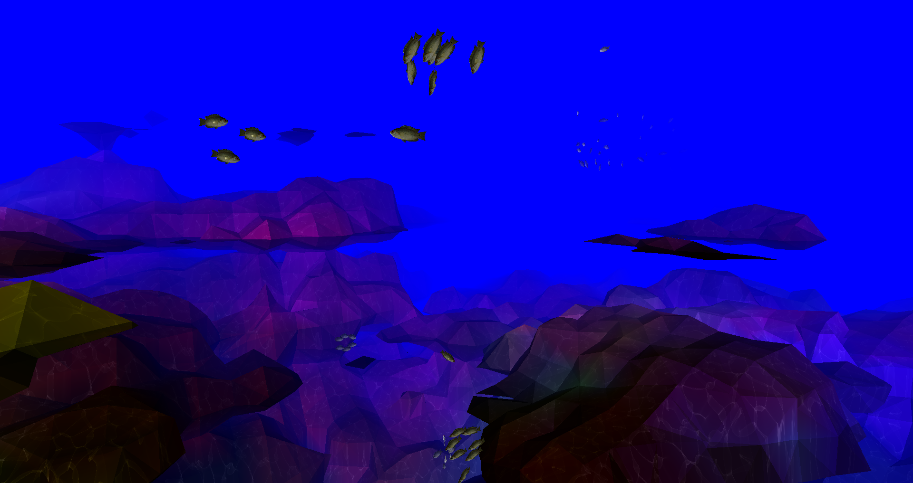

# Boids 

[](https://www.youtube.com/watch?v=4Djj40vwHjo "YT")

_Very long explanation available at [https://kyle.in/boids](https://kyle.in/boids)._

## Technical Details
Most of the heavy lifting is done inside of the world shaders. These are found in `src/shaders`.
The entire world is being generated in real time every frame. This allows real-time modification of the world (see advanced controls).
Shaders are a nightmare to write and debug, the extensive use of shaders in this project should be taken into heavy consideration.

The world generation is fairly straight-forward:

1. Generate a field of vertices and pass them to a geometry shader.
2. In the shader, calculate the value of the Fractional Brownian motion (FBM/density) at that point.
   The density is composed of several octaves of Simplex noise. Perlin noise was used previously but was not as performant.
3. Use the density values coupled with a iso-level (threshold) to create positive and negative regions.
4. Connect the negative regions using the Marching Cubes algorithm.
5. Color the facets using a separate density function tuned to produce color values.
6. Apply lighting (Phong) using a fragment shader.

The fish perform accurate collision detection with the generated world. The fish will recalculate their path based on obstacles
near and around them. This is implemented using the following steps:

1. Use a voxel traversal algorithm to calculate voxels that intersect with the fish's velocity vector.
   http://www.cse.yorku.ca/~amana/research/grid.pdf
2. For each intersected voxel, run marching cubes to generate the voxel's geometry.
3. Run a ray-triangle intersection for each generated facet.
4. If there is an intersection, use a Fibonacci Sphere to generate a new test vector. Repeat until test vector is no longer obstructed.

The world is endless. You can move infinitely in any direction. Boids will be spawned around you as you move away from currently spawned boids.

## Basic Controls
* Movement: WASD
* Exit: ESC
* Click the window to take over the mouse. This will allow you to use the mouse to look around. Click again to release the mouse.

## Advanced Controls

```
   Debug Mode Toggle: x
   Pause Boids Toggle: p
   Use Advanced Commands: t

   _All values below are shown in debug mode (x)_

   Boids:
   Increment/Decrement Cohesion Radius: 1/!
   Increment/Decrement Cohesion Multiplier: 2/@
   Increment/Decrement Separation Radius: 3/#
   Increment/Decrement Separation Multiplier: 4/$
   Increment/Decrement Alignment Radius: 5/%
   Increment/Decrement Alignment Multiplier: 6/^
   Increment/Decrement Max Velocity: 7/&

   Visuals:
   Increment/Decrement Fog Density: 8/*
   Increment/Decrement Caustic Intensity: 9/(
   Increment/Decrement Caustic Scale: 0/)

   World:
   Increment/Decrement Iso Level: c/C
   Increment/Decrement Octaves: v/V
   Increment/Decrement Persistence: b/B
   Increment/Decrement Lacunarity: n/N
   Randomize World Seed: . (period)
```

## Requirements
- OpenGL 4.3+. Note: VMWare does not seem to support anything past 3.3.
- Glut
- Windows/Linux environment, Mac not tested.
- Test machine info included in testspecs.txt

## How to run:
`make && ./main`

## Attributions:
* Fish Model / Texture - https://free3d.com/3d-model/fish---low-poly-82864.html.
* Caustics sequences generated with: https://www.dualheights.se/caustics/
* Code attributions are in comments.
